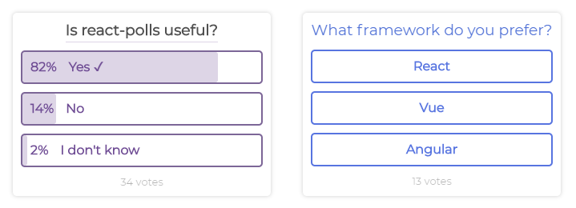

# react-polls
[](https://www.npmjs.com/package/react-polls)
[](https://travis-ci.com/viniciusmeneses/react-polls)
[](https://github.com/viniciusmeneses/react-polls/)
[](https://standardjs.com)
[](https://github.com/viniciusmeneses/react-polls/blob/master/LICENSE)
<!-- [](https://www.npmjs.com/package/react-polls) -->

> Customizable poll component for React

**react-polls** is a poll component for React which can be *easily used and customizable* adding your question and possible answers. It uses browser **Local Storage** to save the user vote and block multiples votes.

<p align="center">
  <a href="http://react-polls.surge.sh/"></a>
</p>

## Demo

If you want to test and view react-polls, go to the online demo by clicking [here](http://react-polls.surge.sh/). The demo source code is available within the example directory.

## Install

Use the package manager to install **react-polls** dependency to your project.

**NPM**
```bash
npm install --save react-polls
```
**Yarn**
```bash
yarn add react-polls
```

## Usage

After installation, import the **Poll** component from **react-polls** dependency and start using it by passing the required props: `question`, `answer` and `onVote`. See **User Guide** section for more information about props.

```jsx
import React, { Component } from 'react';
import Poll from 'react-polls';

// Declaring poll question and answers
const pollQuestion = 'Is react-polls useful?'
const pollAnswers = [
  { option: 'Yes', votes: 8 },
  { option: 'No', votes: 2 }
]

class App extends Component {
  // Setting answers to state to reload the component with each vote
  state = {
    pollAnswers: [...pollAnswers]
  }

  // Handling user vote
  // Increments the votes count of answer when the user votes
  handleVote = voteAnswer => {
    const { pollAnswers } = this.state
    const newPollAnswers = pollAnswers.map(answer => {
      if (answer.option === voteAnswer) answer.votes++
      return answer
    })
    this.setState({
      pollAnswers: newPollAnswers
    })
  }

  render () {
    const { pollAnswers } = this.state
    return (
      <div>
        <Poll question={pollQuestion} answers={pollAnswers} onVote={this.handleVote} />
      </div>
    );
  }
};
```

*This is a basic example, for complex usage, see the **Demo** and **User Guide** sections.*

## Customize

Poll component is able to customizable through `customStyles` prop, the prop receives a object with the following keys and values:

|Key|Value|Description|
|---|---|---|
|*questionSeparator*|Boolean|Enables or disables the separator between question and answers.
|*questionSeparatorWidth*|`'question'` or `'poll'`|Defines the width of separator based on the question or the poll.
|*questionBold*|Boolean|Adds bold to the question font.
|*questionColor*|Hex Color|Sets the color of question font. Must be in hex format `#000000`.
|*align*|`'left'`, `'center'` or `'right'`|Sets the align of question and total votes.
|*theme*|`'purple'`, `'red'`, `'blue'`, `'black'`, `'white'` or `'cyan'`|Sets the poll theme.

## User guide

Below is listed all the props that can be passed to the **Poll** component:

|Prop|Description|Value|
|---|---|---|
|question|Defines the question that will be added to the top of the poll as title.|Type: `string`<br/>Example: `What's the best framework?`|
|answers|Defines the list of all avaible answers to the poll question and the current votes of each answer. It receives an array of objects that have `option` and `votes` properties.|Type: `array`<br/>Example: ```[{ option: 'React', votes: 23 }]```|
|onVote|Receives a callback function which will be executed when the user vote in a answer. The function receives the text answer as parameter.|Type: `function`<br/>Example: ```voteAnswer => console.log('User voted!')```|
|customStyles *(optional)*|Sets custom styles for the **Poll** component. It receives a object with the following optional properties: <ul><li>`questionSeparator`</li> <li>`questionSeparatorWidth`</li> <li>`questionBold`</li> <li>`questionColor`</li> <li>`align`</li> <li>`theme`</li></ul>|Type: `object`<br/>Example: See at ```examples/src/App.js```|
|noStorage *(optional)*|Disables the use of **LocalStorage** to save the user's vote.|Type: `boolean`<br/>Example: ```false```|
|vote *(optional)*|Receives the text answer and sets the user vote. If set, it will show the poll result. I'd recommend using this prop with **noStorage** prop.|Type: `string`<br/>Example: ```React```|

## Contribute

If you want to contribute in **react-polls**, follow these steps:

- Make a fork of this repository and clone it `git clone fork_url`
- Run ```npm install``` and ```npm start``` to install the dependencies and start the component
- Open a new terminal tab and go to example folder and run `npm start`
- Do the changes and make a [Pull Request](https://github.com/viniciusmeneses/react-polls/pulls)


## License

MIT © [viniciusmeneses](https://github.com/viniciusmeneses)
